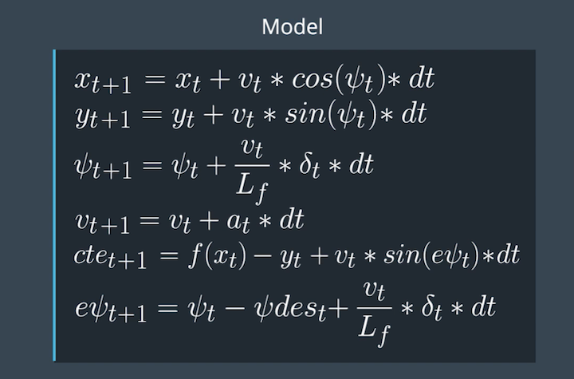

# MODEL PREDICTIVE CONTROL PROJECT DISCUSSION AND NOTES

Following Part discusses the rubric questions and other notes which might be helpful in future. 

In this project, we have to navigate the car in a simulator by proving the steering angle and acceleration value to it. Using a Kinematic model and cost function optimization, we have to make our car follow the trajectory. Cost function is the cross track error which is the distance between car's current position and track waypoints.

As a complete pipeline we have to follow these steps.
1.  Transform states from Map Coordinate system to Car coordinate system.
2.  Implement the logic of Latency.
3.  Pass state values to the MPC controller.
4.  MPC controller will calculate the cost and return the next states.
5.  Visualize the True Waypoints path (Yellow) and MPC predicted path (Green).

## The Model

I have used Kinematic model with the following states.
Car's x and y coordinates,
Car's orientation angle (psi),
Car's velocity,
Cross track error (cte),
error in psi (epsi).
Actuator outputs are steering angle (delta) and acceleration(a).

The update equations are as follow:


## Timestep Length and Elapsed Duration (N & dt)

I have chosen N = 10 and dt = 0.1, values which are suggeted in the quiz. I have tried few other values like N = 25 and dt = 0.05, N = 25 and dt = 0.2, N = 25 and dt = 0.3. It didn't work out for me. 

The other logic I tried is to use dt > latency value as explained in some of the forum links. But that didn't work for me either. The latency part in this project is confusing (I think there are many other parameters like our own system,simulator design etc.). Latency part leads me to think (confuse) about the relation between latency and dt and incorporating them to the equations. Ultimately, I gave up and choose the most "easiest" values!!

## Polynomial Fitting and MPC Preprocessing

To make everything simpler, I have converted waypoints from Map's coordinate system to the Car's coordinate system. By doing this, I can fit the polynomial easily and I can use the simple formula for cross track error `cte = f(x) - y`. This equation is valid only if the X axis points in the direction of the car. Otherwise the calculation of cte changes and it will be difficult.

Also after transforming to the Car's coordinate systems, car's position will be at origin. (x,y) = (0,0) and psi = 0.

## Model Predictive Control with Latency

In this project, we have to implement MPC that handles 100 ms latency.

This was the most confusing, skeptical, vague, not-so-clear part.!!
By following Q and A session and many forum links, things started getting more cleared and it started making sense to me.
I had two options either to implement latency logic before the transformation or after the transformation. 

I have chosen the second option, to implement latency after transformation. 
When we do transformation first, we will have accurate values of `new_px` and `new_py` and accurate values of transformed waypoints.  ** In practice it matters a lot more that the waypoints are as accurate and stable as possible, with as little jitter as possible, because if the waypoints jitter, then that ruins all the optimization that follows to a certain extend. ** 

Latency logic is implemented in `main,cpp` between lines (165-170).

** Still the only confusion is do we use `new_px` (calculated/predicted 100ms in future or px = 0) value while calculating the `cte` in the equation `double cte= polyeval(coeffs,0)+v*sin(epsi)*latency;`


** Few really good discussion links which might be helpful in future for reference.

[Incorporate Latency](https://discussions.udacity.com/t/how-to-incorporate-latency-into-the-model/257391/63)
[Ploting trajectory explanation](https://discussions.udacity.com/t/how-to-get-the-mpc-trajectory-and-plot-it/252583/3)
[More trajectory issue discussion](https://discussions.udacity.com/t/mpc-predicted-trajectory/327751/13)
[My car didn't move at all in first go! The solution was this!](https://discussions.udacity.com/t/mpc-control-car-doesnt-move/574222/2)


# CarND-Controls-MPC
Self-Driving Car Engineer Nanodegree Program

---

## Dependencies

* cmake >= 3.5
 * All OSes: [click here for installation instructions](https://cmake.org/install/)
* make >= 4.1(mac, linux), 3.81(Windows)
  * Linux: make is installed by default on most Linux distros
  * Mac: [install Xcode command line tools to get make](https://developer.apple.com/xcode/features/)
  * Windows: [Click here for installation instructions](http://gnuwin32.sourceforge.net/packages/make.htm)
* gcc/g++ >= 5.4
  * Linux: gcc / g++ is installed by default on most Linux distros
  * Mac: same deal as make - [install Xcode command line tools]((https://developer.apple.com/xcode/features/)
  * Windows: recommend using [MinGW](http://www.mingw.org/)
* [uWebSockets](https://github.com/uWebSockets/uWebSockets)
  * Run either `install-mac.sh` or `install-ubuntu.sh`.
  * If you install from source, checkout to commit `e94b6e1`, i.e.
    ```
    git clone https://github.com/uWebSockets/uWebSockets
    cd uWebSockets
    git checkout e94b6e1
    ```
    Some function signatures have changed in v0.14.x. See [this PR](https://github.com/udacity/CarND-MPC-Project/pull/3) for more details.

* **Ipopt and CppAD:** Please refer to [this document](https://github.com/udacity/CarND-MPC-Project/blob/master/install_Ipopt_CppAD.md) for installation instructions.
* [Eigen](http://eigen.tuxfamily.org/index.php?title=Main_Page). This is already part of the repo so you shouldn't have to worry about it.
* Simulator. You can download these from the [releases tab](https://github.com/udacity/self-driving-car-sim/releases).
* Not a dependency but read the [DATA.md](./DATA.md) for a description of the data sent back from the simulator.


## Basic Build Instructions

1. Clone this repo.
2. Make a build directory: `mkdir build && cd build`
3. Compile: `cmake .. && make`
4. Run it: `./mpc`.

## Tips

1. It's recommended to test the MPC on basic examples to see if your implementation behaves as desired. One possible example
is the vehicle starting offset of a straight line (reference). If the MPC implementation is correct, after some number of timesteps
(not too many) it should find and track the reference line.
2. The `lake_track_waypoints.csv` file has the waypoints of the lake track. You could use this to fit polynomials and points and see of how well your model tracks curve. NOTE: This file might be not completely in sync with the simulator so your solution should NOT depend on it.
3. For visualization this C++ [matplotlib wrapper](https://github.com/lava/matplotlib-cpp) could be helpful.)
4.  Tips for setting up your environment are available [here](https://classroom.udacity.com/nanodegrees/nd013/parts/40f38239-66b6-46ec-ae68-03afd8a601c8/modules/0949fca6-b379-42af-a919-ee50aa304e6a/lessons/f758c44c-5e40-4e01-93b5-1a82aa4e044f/concepts/23d376c7-0195-4276-bdf0-e02f1f3c665d)
5. **VM Latency:** Some students have reported differences in behavior using VM's ostensibly a result of latency.  Please let us know if issues arise as a result of a VM environment.

## Editor Settings

We've purposefully kept editor configuration files out of this repo in order to
keep it as simple and environment agnostic as possible. However, we recommend
using the following settings:

* indent using spaces
* set tab width to 2 spaces (keeps the matrices in source code aligned)

## Code Style

Please (do your best to) stick to [Google's C++ style guide](https://google.github.io/styleguide/cppguide.html).

## Project Instructions and Rubric

Note: regardless of the changes you make, your project must be buildable using
cmake and make!

More information is only accessible by people who are already enrolled in Term 2
of CarND. If you are enrolled, see [the project page](https://classroom.udacity.com/nanodegrees/nd013/parts/40f38239-66b6-46ec-ae68-03afd8a601c8/modules/f1820894-8322-4bb3-81aa-b26b3c6dcbaf/lessons/b1ff3be0-c904-438e-aad3-2b5379f0e0c3/concepts/1a2255a0-e23c-44cf-8d41-39b8a3c8264a)
for instructions and the project rubric.

## Hints!

* You don't have to follow this directory structure, but if you do, your work
  will span all of the .cpp files here. Keep an eye out for TODOs.

## Call for IDE Profiles Pull Requests

Help your fellow students!

We decided to create Makefiles with cmake to keep this project as platform
agnostic as possible. Similarly, we omitted IDE profiles in order to we ensure
that students don't feel pressured to use one IDE or another.

However! I'd love to help people get up and running with their IDEs of choice.
If you've created a profile for an IDE that you think other students would
appreciate, we'd love to have you add the requisite profile files and
instructions to ide_profiles/. For example if you wanted to add a VS Code
profile, you'd add:

* /ide_profiles/vscode/.vscode
* /ide_profiles/vscode/README.md

The README should explain what the profile does, how to take advantage of it,
and how to install it.

Frankly, I've never been involved in a project with multiple IDE profiles
before. I believe the best way to handle this would be to keep them out of the
repo root to avoid clutter. My expectation is that most profiles will include
instructions to copy files to a new location to get picked up by the IDE, but
that's just a guess.

One last note here: regardless of the IDE used, every submitted project must
still be compilable with cmake and make./

## How to write a README
A well written README file can enhance your project and portfolio.  Develop your abilities to create professional README files by completing [this free course](https://www.udacity.com/course/writing-readmes--ud777).
